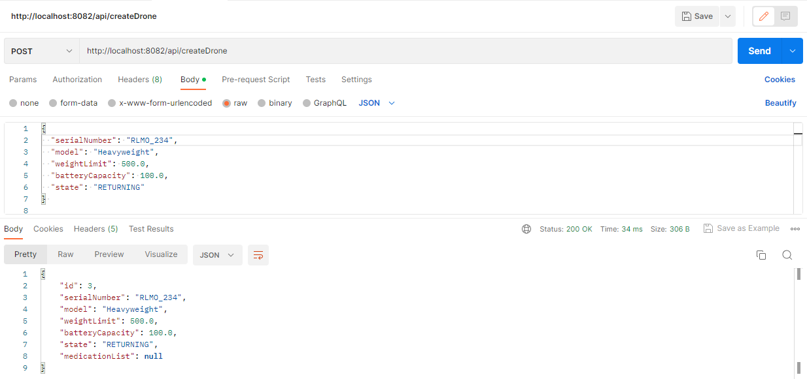
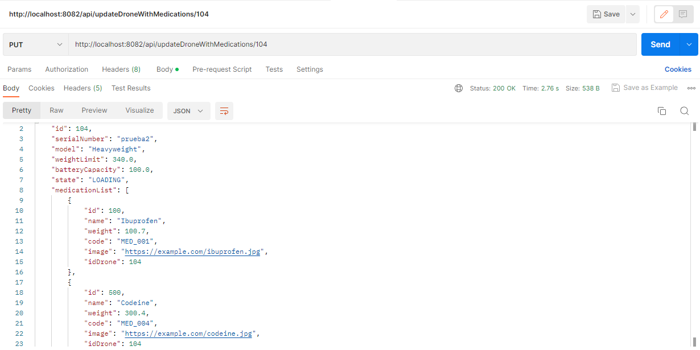
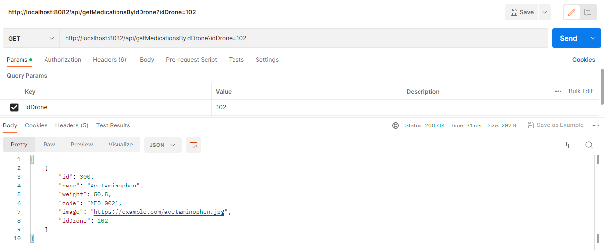
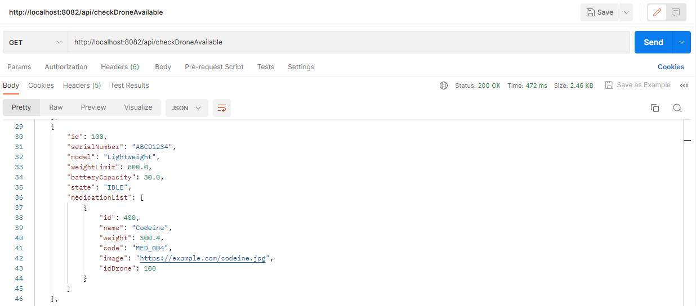
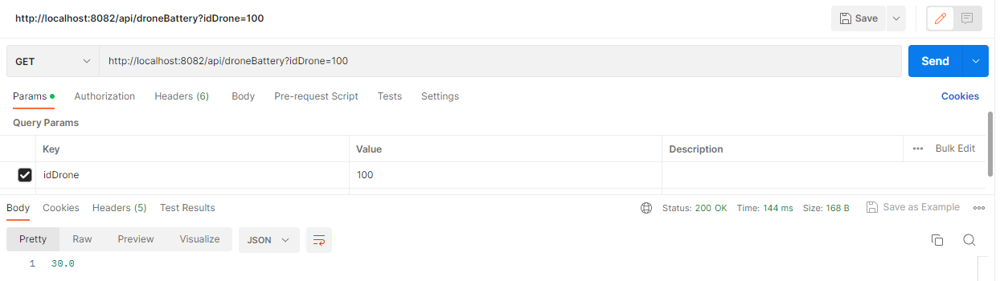
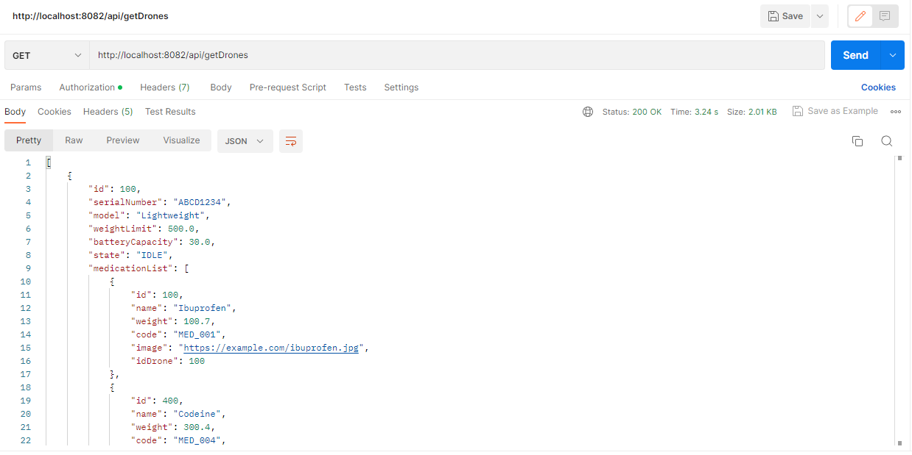
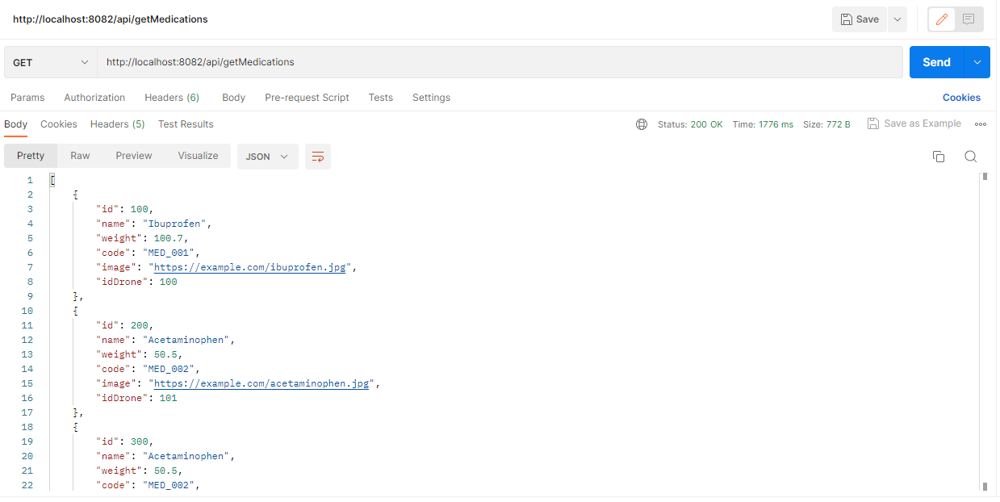

# Necessary installation:

1. Java 17: https://www.oracle.com/java/technologies/javase/jdk17-archive-downloads.html
2. It is recommended to run the project in Intellij community: https://www.jetbrains.com/idea/download/#section=windows
3. Download Gradle version 7.6.1 and put it in the environment variables: https://gradle.org/releases/
4. Install postman

# Base Project Implementing Clean Architecture

## Before you start

We will start by explaining the different components of the project and we will start with the external components, continuing with the core business components (domain) and finally the start and configuration of the application.

# Architecture


## Domain

It is the most internal module of the architecture, it belongs to the domain layer and encapsulates the business logic and rules through models and domain entities.

## Usecases

This module, belonging to the domain layer, implements the use cases of the system, defines application logic and reacts to the invocations from the entry points module, orchestrating the flows towards the entities module.

## Infrastructure

### Driven Adapters

The driven adapters represent external implementations to our system, such as connections to rest services,
soap, databases, reading flat files, and specifically any origin and source of data with which we must
interact.

### Entry Points

Entry points represent the entry points of the application or the start of business flows.

## Application

This module is the most external of the architecture, it is in charge of assembling the different modules, resolving the dependencies and creating the beans of the use cases (UseCases) automatically, injecting concrete instances of the declared dependencies into them. It also starts the application (it is the only module in the project where we will find the function [public static void main(String[] args)].

**The use case beans are made available automatically thanks to a '@ComponentScan' placed in this layer.**

# Steps to run the project:

1. Clone the project: https://github.com/richardmazo/drones
2. Open the project with Intellij
3. The MainApplication of the application is located in the folder: applications/app-service/src/main/java/cp.com.musala/MainApplication.java
4. Before running the application make sure to configure and install Java 17, Gradle 7.6.1 and postman

# API service:

The exposed port of the localhost is 8082

1. Register drones: http://localhost:8082/api/createDrone
   
   Example JSON - POST:
```
{
  "serialNumber": "RLMO_234",
  "model": "Heavyweight",
  "weightLimit": 500.0,
  "batteryCapacity": 100.0,
  "state": "RETURNING"
} 
```

2. Loading a drone with medication items: http://localhost:8082/api/updateDroneWithMedications/104
   
   Example JSON - PUT:
```
    {
        "id": 104,
        "serialNumber": "prueba2",
        "model": "Heavyweight",
        "weightLimit": 340.0,
        "batteryCapacity": 100.0,
        "state": "IDLE",
        "medicationList": [
        {
            "id": 100,
            "name": "Ibuprofen",
            "weight": 100.7,
            "code": "MED_001",
            "image": "https://example.com/ibuprofen.jpg",
            "idDrone": 104
        },
        {
            "id": 500,
            "name": "Codeine",
            "weight": 300.4,
            "code": "MED_004",
            "image": "https://example.com/codeine.jpg",
            "idDrone": 104
        }                                 
        ]
    }
```

3. Check loaded medication items for a given drone: http://localhost:8082/api/getMedicationsByIdDrone?idDrone=102
   

4. Check available drones for loading: http://localhost:8082/api/checkDroneAvailable
   

5. Check drone baterry level for a given drone: http://localhost:8082/api/droneBattery?idDrone=100
   

## Additional services:

1. Get all drones: http://localhost:8082/api/getDrones
   

2. Get all medications: http://localhost:8082/api/getMedications
   

# Database:

To enter the H2 database the project must be running locally. Then access the following link:

http://localhost:8082/h2

User: sa

Password: password

### Available tables:

- TBL_DRONE: Table with all the drones.

- TBL_MEDICATION: Table with all medications.

- TBL_DRONE_AUDIT: Audit table that saves the battery reviews that are done to the drones (This process is executed every three minutes automatically while the application is running locally).


